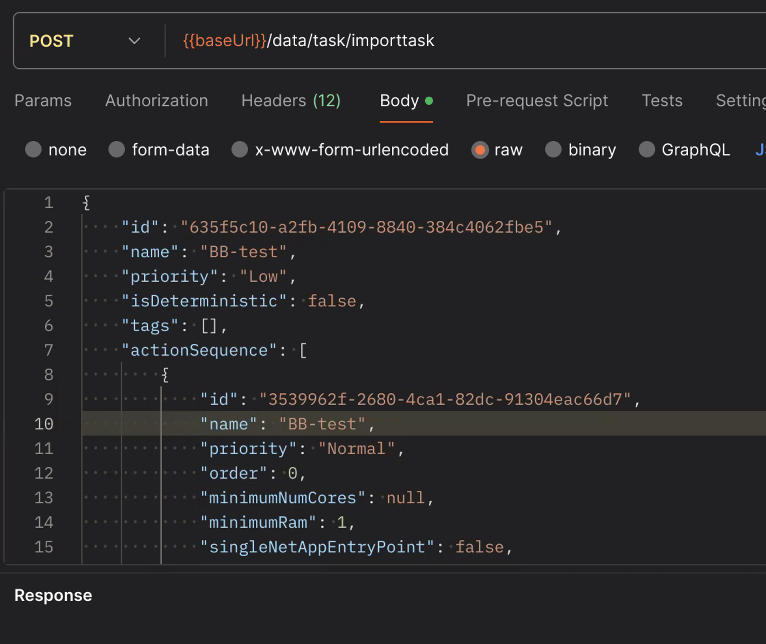

# signal_quality_network_application_ros2 docker

This package allows the robot to create semantic maps that can later be translated into occupancy grid maps merged with the main map topic. Semantic interpretations are easy to configure as a list of colors to be considered "virtual" obstacles in the new map. I.E Low quality area of radio 5G signal. This in term will make the nav2 package avoid the blind spots. This application is very useful for cloud based mobile robots that offload computational resources to the cloud and want to keep QoS and QoE specific metrics using docker

To launch the semantic mapping, which creates a pointcloud2 around the robot boundingbox, run:
# Requirements and setup:
This code was tested in ROS 2 Humble. Copy the content of this repository by using either git clone or manual download and paste it to your /src folder in your ros2 workspace. Then follow by building the ws.

```
# LAUNCH SIMULATION 
export ROS_DOMAIN_ID=0
source /opt/ros/humble/setup.bash
export TURTLEBOT3_MODEL=waffle
export GAZEBO_MODEL_PATH=$GAZEBO_MODEL_PATH:/opt/ros/humble/share/turtlebot3_gazebo/models
ros2 launch nav2_bringup tb3_simulation_launch.py headless:=False
```
## Deployment with docker
To launch both services (signal_mapper and sub_signal_mapper) at the same time detached run:
```
docker compose up -d
```
To convert pointcloud to OcupancyGrid map run from costmap-translate:
```
docker compose up
```

To run each service (signal_mapper and sub_signal_mapper) separate open terminal from coresponding folder(ex signal_mapper) and run:
```
docker compose up
```

To create images for container:
from folder signal_mapper run 
```
docker build . -t signal-mapper:1.0
```
From folder sub_signal_mapper run 
```
docker build . -t sub-signal-mapper:1.0
```


## Deployment with kubernetes:
Must be run from terminal of file location
```
kubectl apply -f signal-quality-map.yaml
```

## Deployment with middleware:

TaskId= c1e383cd-61f5-40d7-abe1-0796919ed8b0

Robot_id= 300c719a-1c06-4500-a13a-c2e20592b273

can be deployed with postman



or docker container
```
docker run --network host --rm -e USE_MIDDLEWARE=true -e MIDDLEWARE_ADDRESS=192.168.50.80:31000 -e MIDDLEWARE_USER=ad20f254-dc3b-406d-9f15-b73ccd47e867 -e MIDDLEWARE_PASSWORD=middleware -e MIDDLEWARE_TASK_ID=8b96277b-83ff-43ee-88be-aae512c270ff -e MIDDLEWARE_ROBOT_ID=300c719a-1c06-4500-a13a-c2e20592b273 but5gera/ros2_relay_client:1.1.0
```

## Deployment with relay only:

Client(Robot)
```
docker run --network host --rm -e ROS_DOMAIN_ID=0 -e NETAPP_ADDRESS=http://192.168.0.80:5896 -e TOPICS_TO_SERVER='[{"name":"/amcl_pose","type":"geometry_msgs/msg/PoseWithCovarianceStamped","qos":{"durability":"TRANSIENT_LOCAL","reliability":"RELIABLE","history":"KEEP_LAST","depth":1}}]' -e TOPICS_FROM_SERVER='[{"name": "/semantic_pcl","type": "sensor_msgs/msg/PointCloud2","compression": "lz4"}]' but5gera/ros2_relay_client:1.2.2
```

Server
```
docker run --network host --rm -e ROS_DOMAIN_ID=30 -e TOPICS_FROM_CLIENT='[{"name": "/amcl_pose","type":"geometry_msgs/msg/PoseWithCovarianceStamped","qos":{"durability":"TRANSIENT_LOCAL","reliability":"RELIABLE","history":"KEEP_LAST","depth":1}}]' -e TOPICS_TO_CLIENT='[{"name": "/semantic_pcl","type": "sensor_msgs/msg/PointCloud2","compression": "lz4"}]' but5gera/ros2_relay_server:1.2.2
```